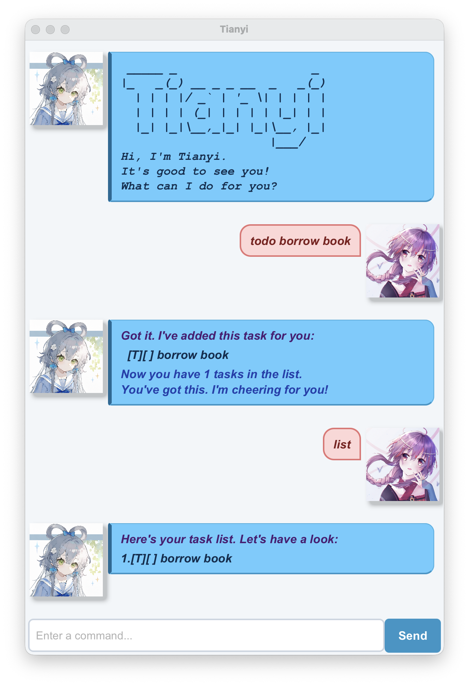

# Tianyi

Tianyi is a friendly desktop chatbot for managing todos, deadlines, and events through simple typed commands. It
keeps your tasks between sessions and lets you list, search, complete, reopen, and delete them.



[User Guide](https://HXY070103.github.io/ip/) |
[Download Tianyi](https://github.com/HXY070103/ip/releases)

## Features

- Creates todos, deadlines, and events.
- Supports dates and optional times for scheduled tasks.
- Lists all tasks or filters dated tasks by date.
- Finds tasks by keywords in their descriptions.
- Marks tasks as completed or incomplete.
- Saves changes automatically for the next session.

See the [User Guide](https://HXY070103.github.io/ip/) for command formats and examples.

## Running Tianyi

1. Ensure that Java 25 is installed.
2. Download `Tianyi.jar` from the [releases page](https://github.com/HXY070103/ip/releases).
3. Open a terminal in the folder containing the JAR file.
4. Run:

   ```bash
   java -jar Tianyi.jar
   ```

Tianyi stores its data in `Data/tianyi.txt`, relative to the folder from which it is run.

## Developer setup

Prerequisites:

- JDK 25
- A recent version of IntelliJ IDEA

On macOS, select the project's prescribed Java version with SDKMAN if needed:

```bash
sdk use java 25.0.3.fx-zulu
```

To set up the project in IntelliJ IDEA:

1. Open IntelliJ IDEA and select **Open**.
2. Select this repository's root directory.
3. Accept the default Gradle import settings.
4. Set the project SDK to JDK 25 and the language level to **SDK default**.
5. Run `tianyi.Launcher.main()` to start the graphical application.

Alternatively, run the application from the repository root:

```bash
./gradlew run
```

Keep Java source files under `src/main/java` and test files under `src/test/java`, as expected by Gradle.

## Testing

Run the automated tests:

```bash
./gradlew test
```

Run all verification tasks, including tests and Checkstyle:

```bash
./gradlew check
```

## Building the JAR

Create an executable JAR containing the application's dependencies:

```bash
./gradlew shadowJar
```

The generated file is located at `build/libs/Tianyi.jar`.
